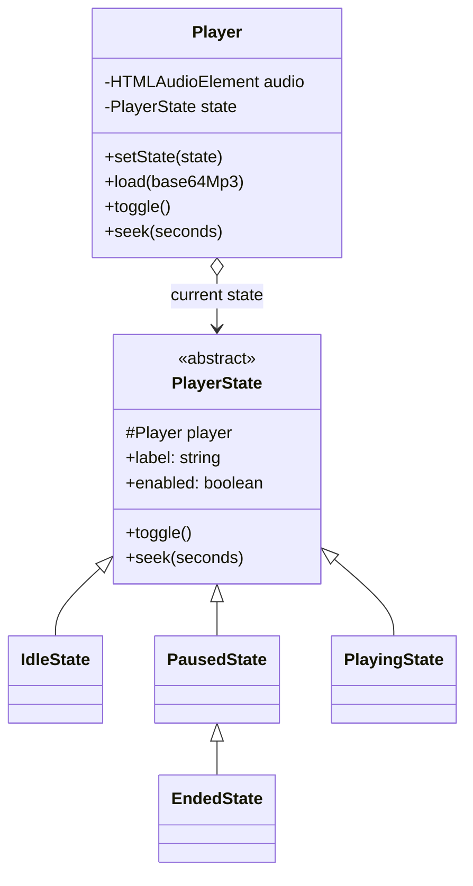
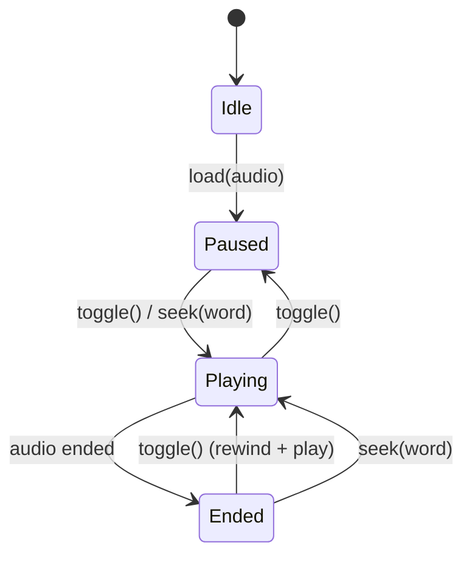
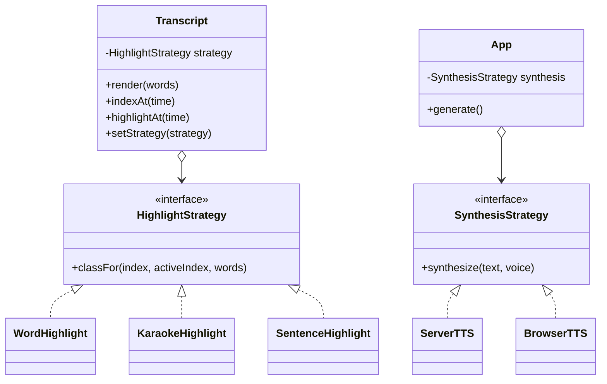
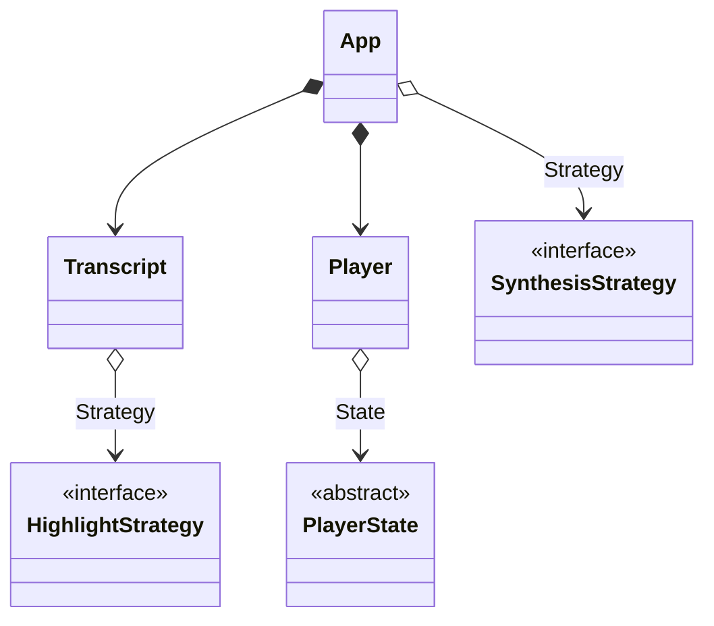

# Design Patterns in This Project

Two behavioural patterns fit this codebase naturally: **State** (for the audio player)
and **Strategy** (for how the transcript highlights, and for how audio gets
synthesized). Both are illustrated against the classes that already exist in
`public/app.js` and `server.js`.

Current classes:

| Class | File | Responsibility |
| --- | --- | --- |
| `TTSClient` | `public/app.js` | Calls `POST /api/tts`, returns `{audio, words}` |
| `Transcript` | `public/app.js` | Renders word spans, maps a time to a word, highlights |
| `Player` | `public/app.js` | Wraps `<audio>`, play/pause/seek, per-frame tick |
| `App` | `public/app.js` | Wires DOM to the three collaborators above |

---

## 1. State Pattern — the `Player`

### Intent

Let an object change its behaviour when its internal state changes. The object
appears to change class. Each state is its own class that knows what the
operations mean *while in that state*, and which state comes next.

### The problem in the current code

The player's state machine is real, but it is scattered and implicit:

- `Player.toggle()` (`public/app.js:86`) branches on `audio.paused`.
- `App.#syncButton()` (`public/app.js:152`) re-derives the label from `isPlaying`.
- `App.generate()` sets `playPauseEl.disabled = false` after loading audio.
- Nothing models "ended" — after playback finishes, pressing Play restarts only
  because the browser happens to rewind.

One state machine, encoded in four places. Adding a "loading" or "ended"
behaviour means editing all four.

### States

| State | Meaning | Button label | Button enabled |
| --- | --- | --- | --- |
| `IdleState` | No audio generated yet | `Play` | no |
| `PausedState` | Audio loaded, stopped | `Play` | yes |
| `PlayingState` | Audio running | `Pause` | yes |
| `EndedState` | Reached the end | `Play` | yes (restarts) |

### Implementation

```js
class PlayerState {
    constructor(player) {
        this.player = player;
    }
    get label() {
        return "Play";
    }
    get enabled() {
        return true;
    }
    toggle() {}
    seek(seconds) {
        this.player.audio.currentTime = seconds;
    }
}

class IdleState extends PlayerState {
    get enabled() {
        return false;
    }
    seek() {} // clicking a word does nothing before audio exists
}

class PausedState extends PlayerState {
    toggle() {
        this.player.audio.play(); // transitions to PlayingState
    }
    seek(seconds) {
        super.seek(seconds);
        this.player.audio.play(); // clicking a word starts playback
    }
}

class PlayingState extends PlayerState {
    get label() {
        return "Pause";
    }
    toggle() {
        this.player.audio.pause(); // transitions to PausedState
    }
}

class EndedState extends PausedState {
    toggle() {
        this.player.audio.currentTime = 0;
        this.player.audio.play();
    }
}
```

`Player` becomes a thin context object. It holds the current state and delegates
to it; the DOM audio events drive the transitions:

```js
class Player {
    constructor(onTick, onStateChange) {
        this.audio = new Audio();
        this.onTick = onTick;
        this.onStateChange = onStateChange;
        this.frame = null;
        this.setState(new IdleState(this));

        this.audio.addEventListener("play", () => {
            this.setState(new PlayingState(this));
            this.#loop();
        });
        this.audio.addEventListener("pause", () => this.setState(new PausedState(this)));
        this.audio.addEventListener("ended", () => this.setState(new EndedState(this)));
    }

    setState(state) {
        this.state = state;
        this.onStateChange(state);
    }

    load(base64Mp3) {
        this.audio.src = "data:audio/mpeg;base64," + base64Mp3;
        this.setState(new PausedState(this));
    }

    toggle() {
        this.state.toggle();
    }

    seek(seconds) {
        this.state.seek(seconds);
        this.onTick(seconds);
    }
}
```

`App` stops deriving anything. It reacts to a state change:

```js
onStateChange(state) {
    this.playPauseEl.textContent = state.label;
    this.playPauseEl.disabled = !state.enabled;
}
```

The `playPauseEl.disabled = false` line inside `generate()` disappears —
`Player.load()` now owns that transition.

### UML — class diagram



### UML — state diagram



---

## 2. Strategy Pattern

### Intent

Define a family of interchangeable algorithms behind one interface, so the
algorithm can be selected (and swapped) at runtime without the caller changing.

### 2a. `HighlightStrategy` — how the transcript marks words

Today `Transcript.highlightAt()` (`public/app.js:55-63`) hardcodes one rule:
the current word gets `active`, every earlier word gets `spoken`. That is a
policy, not a mechanism — a perfect Strategy candidate.

```js
class HighlightStrategy {
    /** @returns {"active"|"spoken"|null} the CSS class for word i */
    classFor(index, activeIndex, words) {
        return null;
    }
}

class WordHighlight extends HighlightStrategy {
    classFor(index, activeIndex) {
        if (index === activeIndex) return "active";
        return index < activeIndex ? "spoken" : null;
    }
}

class KaraokeHighlight extends HighlightStrategy {
    // Only the current word is marked; no grey trail behind it.
    classFor(index, activeIndex) {
        return index === activeIndex ? "active" : null;
    }
}

class SentenceHighlight extends HighlightStrategy {
    // Highlights the whole sentence containing the current word.
    classFor(index, activeIndex, words) {
        if (activeIndex < 0) return null;
        const [from, to] = index < activeIndex ? [index, activeIndex] : [activeIndex, index];
        const sentenceBreak = words
            .slice(from, to)
            .some((word) => /[.!?]$/.test(word.text));
        if (!sentenceBreak) return "active";
        return index < activeIndex ? "spoken" : null;
    }
}
```

`Transcript` takes a strategy and delegates the decision:

```js
class Transcript {
    constructor(container, onWordClick, strategy = new WordHighlight()) {
        this.container = container;
        this.onWordClick = onWordClick;
        this.strategy = strategy;
        this.words = [];
        this.spans = [];
        this.activeIndex = -1;
    }

    setStrategy(strategy) {
        this.strategy = strategy;
        this.activeIndex = -1; // force a repaint on the next tick
    }

    highlightAt(time) {
        const index = this.indexAt(time);
        if (index === this.activeIndex) return;
        this.activeIndex = index;
        this.spans.forEach((span, i) => {
            const cls = this.strategy.classFor(i, index, this.words);
            span.classList.toggle("active", cls === "active");
            span.classList.toggle("spoken", cls === "spoken");
        });
        this.spans[index]?.scrollIntoView({ block: "nearest", behavior: "smooth" });
    }
}
```

A `<select>` in the UI can now switch highlight styles mid-playback with
`transcript.setStrategy(new SentenceHighlight())` — no change to `Transcript`,
`Player`, or `App` logic.

### 2b. `SynthesisStrategy` — where the audio comes from

`TTSClient` is already one strategy: "ask the Express backend, which uses
`edge-tts-universal`". A second one is the browser's built-in
`speechSynthesis`, useful as an offline fallback. Both answer the same call.

```js
class SynthesisStrategy {
    /** @returns {Promise<{audio: string|null, words: Array}>} */
    async synthesize(text, voice) {
        throw new Error("not implemented");
    }
}

class ServerTTS extends SynthesisStrategy {
    constructor(endpoint = "/api/tts") {
        super();
        this.endpoint = endpoint;
    }
    async synthesize(text, voice) {
        const res = await fetch(this.endpoint, {
            method: "POST",
            headers: { "Content-Type": "application/json" },
            body: JSON.stringify({ text, voice }),
        });
        const data = await res.json();
        if (!res.ok) throw new Error(data.error || "synthesis failed");
        return data; // { audio: base64 mp3, words: [{text, start, end}] }
    }
}

class BrowserTTS extends SynthesisStrategy {
    // Uses the platform speechSynthesis engine; no server round-trip.
    async synthesize(text) {
        return { audio: null, words: this.#estimateWords(text) };
    }
    #estimateWords(text) { /* rough timings from word length */ }
}
```

`App` keeps a strategy field instead of a hardcoded client:

```js
this.synthesis = navigator.onLine ? new ServerTTS() : new BrowserTTS();
const { audio, words } = await this.synthesis.synthesize(text, this.voiceEl.value);
```

`App` never learns which engine ran. That is the whole point of the pattern.

### UML — class diagram



---

## 3. State vs Strategy

Structurally the two patterns are twins: a context object holds a reference to a
polymorphic helper and delegates to it. The difference is in *who chooses* and
*what the helper knows*.

| | State | Strategy |
| --- | --- | --- |
| Who selects the object | The states themselves, via transitions | The client / user / configuration |
| Does it change during one run? | Yes, constantly | Rarely, and only on request |
| Do the variants know each other? | Yes — a state constructs its successor | No — strategies are independent |
| Models | A lifecycle | An interchangeable algorithm |
| Here | `Idle → Paused → Playing → Ended` | Word / karaoke / sentence highlighting; server vs browser TTS |

A useful test: if removing one variant breaks the transitions of another, it is
State. If each variant could be deleted without the others noticing, it is
Strategy.

## 4. Full picture



`App` composes the collaborators (composition — they die with it). Each
collaborator aggregates the pluggable object that varies (aggregation — swappable
at runtime).

## 5. Applying this to the current code

Nothing above is in `public/app.js` yet; the file ships the simple version
(implicit state, hardcoded highlighting, a single `TTSClient`). Adopt in this
order, smallest payoff first:

1. **State on `Player`** — pays for itself immediately: it removes the duplicated
   button-label logic and adds a real "ended" behaviour.
2. **`HighlightStrategy`** — worth it once there is a second highlight mode to
   offer; before then `WordHighlight` alone is an interface with one
   implementation.
3. **`SynthesisStrategy`** — worth it only when a second engine (offline
   fallback, a different provider) actually exists.
