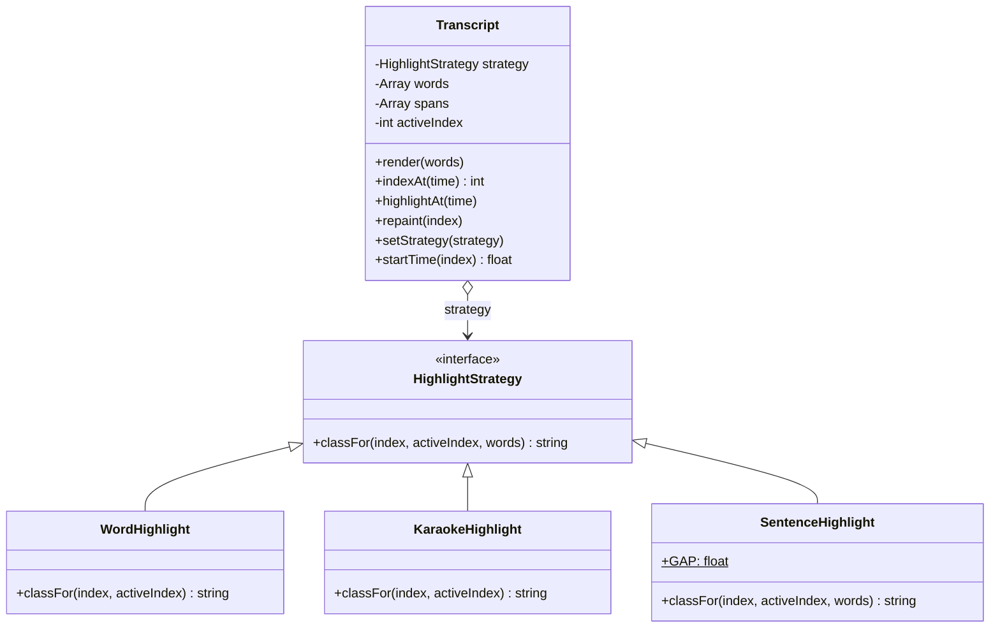
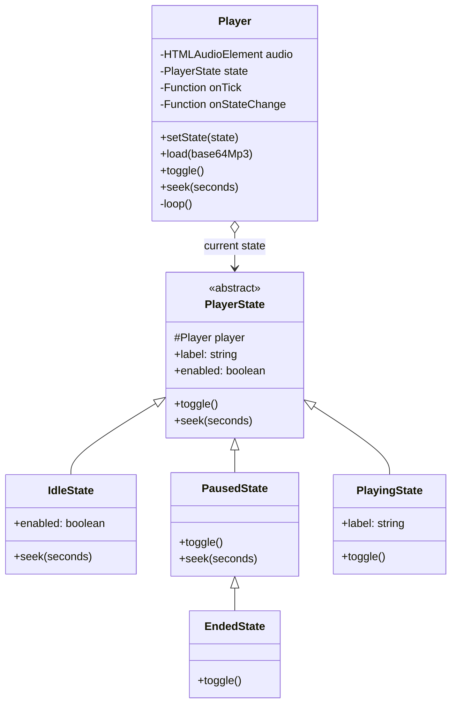
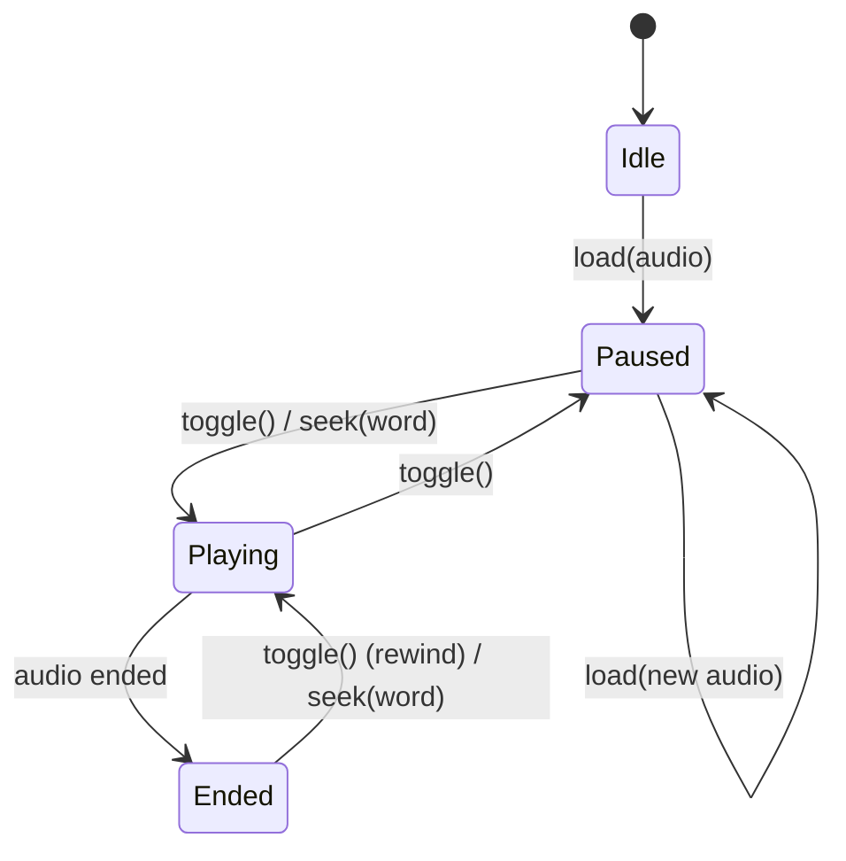
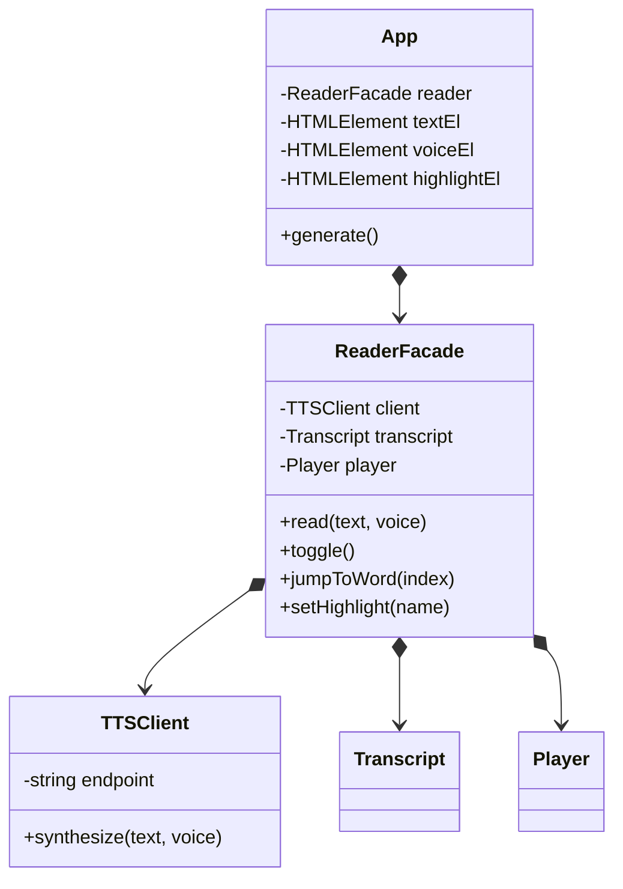
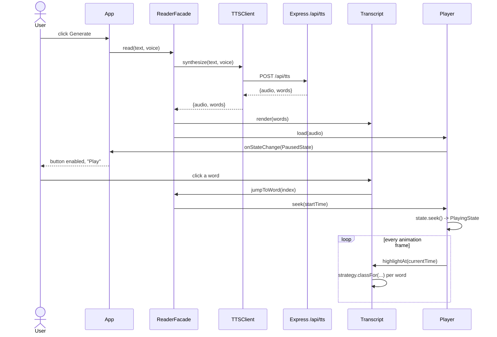
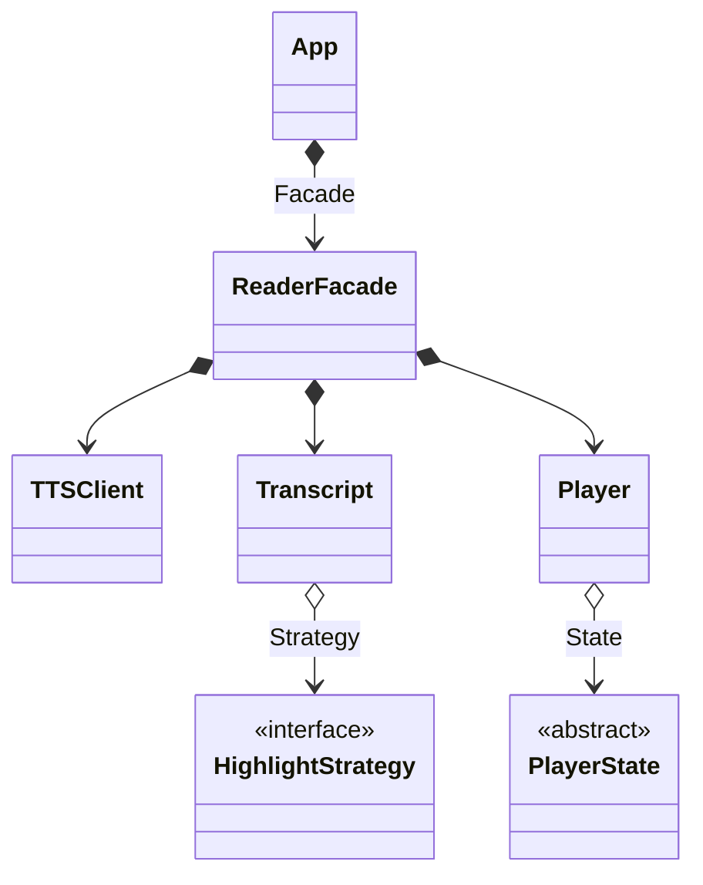

# Design Patterns in This Project

Three patterns are **implemented** in `public/app.js`: **Strategy** (how the
transcript highlights), **State** (what the player does at each point of its
lifecycle) and **Facade** (`ReaderFacade`, the single door in front of the three
collaborators). This document explains each pattern, points at the exact code,
and shows the UML.

## Class map

| Class | Lines in `public/app.js` | Role |
| --- | --- | --- |
| `HighlightStrategy` | 8 | Strategy interface |
| `WordHighlight`, `KaraokeHighlight`, `SentenceHighlight` | 16, 24, 31 | Concrete strategies |
| `PlayerState` | 62 | State interface |
| `IdleState`, `PausedState`, `PlayingState`, `EndedState` | 81, 89, 100, 110 | Concrete states |
| `TTSClient` | 122 | Calls `POST /api/tts` |
| `Transcript` | 141 | Renders spans, maps a time to a word, repaints |
| `Player` | 202 | Wraps `<audio>`, delegates to its state |
| `ReaderFacade` | 258 | Facade over client + transcript + player |
| `App` | 292 | DOM wiring only |

---

## 1. Strategy Pattern — how words get highlighted

### What the pattern is

Define a family of interchangeable algorithms behind a single interface, so the
algorithm can be chosen — and swapped — at runtime without the object that uses
it changing at all. The user of the algorithm ("the context") knows only the
interface; each concrete strategy is independent of the others.

### Where it applies here

Deciding which words look "current" and which look "already spoken" is a
*policy*, not a mechanism. Three sensible policies exist, and a user might want
a different one mid-playback, so the decision is pulled out of `Transcript` into
its own object.

`Transcript` is the context. It holds one `HighlightStrategy` and asks it, per
word, which CSS class to apply (`repaint()`, line 188):

```js
repaint(index) {
    this.spans.forEach((span, i) => {
        const cls = this.strategy.classFor(i, index, this.words);
        span.classList.toggle("active", cls === "active");
        span.classList.toggle("spoken", cls === "spoken");
    });
}
```

The three implementations:

| Strategy | Behaviour |
| --- | --- |
| `WordHighlight` (default) | Current word `active`, all earlier words `spoken` |
| `KaraokeHighlight` | Only the current word `active`, no trail behind it |
| `SentenceHighlight` | The whole current sentence `active`, earlier sentences `spoken` |

`SentenceHighlight` has to find sentence boundaries without punctuation, because
the Edge TTS `WordBoundary` events report bare words. It infers a break from the
silence between two words (`GAP = 0.25` seconds) — the same silence a listener
hears as a full stop.

Swapping is one call, `ReaderFacade.setHighlight()` (line 283), wired to the
`#highlight` `<select>` in `public/index.html`:

```js
setHighlight(name) {
    this.transcript.setStrategy(HIGHLIGHTS[name]());
}
```

`setStrategy()` (line 151) immediately repaints with the new policy, so the
change is visible mid-sentence. Nothing else in the codebase changes when a
fourth strategy is added: write the class, add one line to the `HIGHLIGHTS` map
(line 52) and one `<option>`.

### UML



---

## 2. State Pattern — what the player can do right now

### What the pattern is

Let an object alter its behaviour when its internal state changes; the object
appears to change class. Each state becomes a class holding the behaviour valid
*in that state*, and the states drive the transitions between one another. It
replaces conditionals that test a status flag in many places.

### Where it applies here

The player has a real lifecycle: nothing loaded, loaded but stopped, running,
finished. Before this refactor the lifecycle was implicit and duplicated —
`toggle()` branched on `audio.paused`, the button label was re-derived
separately, and `disabled` was flipped by hand after generation. There was no
"ended" concept at all, so the button still said "Pause" after playback ran out.

Now `Player` is a thin context (line 202). It stores the current state and
delegates:

```js
toggle() {
    this.state.toggle();
}

seek(seconds) {
    this.state.seek(seconds);
    this.onTick(seconds);
}
```

The four states:

| State | Meaning | `label` | `enabled` | `toggle()` | `seek()` |
| --- | --- | --- | --- | --- | --- |
| `IdleState` | Nothing generated yet | `Play` | `false` | nothing | ignored |
| `PausedState` | Loaded, stopped | `Play` | `true` | `audio.play()` | seek **and** play |
| `PlayingState` | Running | `Pause` | `true` | `audio.pause()` | seek, keep playing |
| `EndedState` | Finished | `Play` | `true` | rewind to 0, play | seek **and** play |

`EndedState extends PausedState`, because "finished" behaves like "stopped"
except that pressing play starts over rather than resuming at the end.

Transitions are driven by the real `<audio>` events, so the state can never
disagree with the element (line 208-221):

```js
this.audio.addEventListener("play",  () => { this.setState(new PlayingState(this)); this.#loop(); });
this.audio.addEventListener("pause", () => { this.setState(new PausedState(this)); … });
this.audio.addEventListener("ended", () => { this.setState(new EndedState(this)); … });
```

Every state change is published through `onStateChange`, and the UI simply
mirrors it (`App`, line 305):

```js
onPlayerState: (state) => {
    this.playPauseEl.textContent = state.label;
    this.playPauseEl.disabled = !state.enabled;
},
```

The button label and the disabled flag now have exactly one source of truth. The
old `#syncButton()` helper and the manual `playPauseEl.disabled = false` line in
`generate()` are gone.

### UML — class diagram



### UML — state machine



---

## 3. Facade Pattern — `ReaderFacade`

### What the pattern is

Provide one simplified interface to a set of collaborating objects. The facade
does not add behaviour or hide the subsystem from anyone who needs it; it gives
the ordinary caller a small, task-shaped door instead of a wall of objects and
an ordering the caller must get right.

### Where it applies here

Reading text aloud takes four coordinated steps across three objects: call
`TTSClient.synthesize()`, feed the words to `Transcript.render()`, feed the
audio to `Player.load()`, and connect the player's per-frame tick back into
`Transcript.highlightAt()`. Get the order wrong and the highlight desynchronises.
Previously `App` did all of this itself, so the DOM layer knew the whole
subsystem.

`ReaderFacade` (line 258) owns the wiring, including the two callbacks that
close the loop between player and transcript:

```js
class ReaderFacade {
    constructor(container, { onStatus, onPlayerState }) {
        this.onStatus = onStatus;
        this.client = new TTSClient();
        this.transcript = new Transcript(container, (i) => this.jumpToWord(i));
        this.player = new Player((time) => this.transcript.highlightAt(time), onPlayerState);
    }

    async read(text, voice) { … }
    toggle() { … }
    jumpToWord(index) { … }
    setHighlight(name) { … }
}
```

Its whole public surface is four methods:

| Method | What it hides |
| --- | --- |
| `read(text, voice)` | fetch → render → load → status updates |
| `toggle()` | play/pause routed through the current `PlayerState` |
| `jumpToWord(index)` | word index → start time → `Player.seek()` |
| `setHighlight(name)` | strategy lookup → `Transcript.setStrategy()` → repaint |

`App` (line 292) now reads like a control panel: grab elements, build one
facade, bind three listeners. It never names `TTSClient`, `Transcript` or
`Player`.

Note what the facade does **not** do: it does not wrap or restrict the
subsystem. `ReaderFacade.transcript` and `.player` are still reachable for
anything unusual. That is the difference between a Facade and an Adapter or a
Proxy — a facade is a convenience, not a barrier.

### UML



### Sequence — one "Generate", then a word click



---

## 4. State vs Strategy

Structurally the two are twins: a context holds a polymorphic helper and
delegates to it. The difference is *who picks the helper* and *what the helper
knows*.

| | State | Strategy |
| --- | --- | --- |
| Who selects it | The states themselves, plus the audio events | The user, via the highlight `<select>` |
| Changes during one run? | Constantly | Only when asked |
| Do variants know each other? | Yes — `PausedState.toggle()` causes `PlayingState` | No — the three highlights ignore each other |
| Models | A lifecycle | An interchangeable algorithm |
| Here | `Idle → Paused → Playing → Ended` | Word / karaoke / sentence highlighting |

Useful test: delete one variant. If another variant's transitions break, it was
State. If nobody notices, it was Strategy.

---

## 5. The whole picture



Composition (filled diamond) for the parts that live and die with their owner;
aggregation (hollow diamond) for the pluggable objects that are swapped at
runtime.

---

## 6. What is deliberately *not* a pattern here

- **`HIGHLIGHTS` (line 52)** is a plain name → constructor map, not a Factory.
  It exists so the `<select>` value can name a strategy. A Factory would be
  warranted only if creating a strategy needed real work.
- **A `SynthesisStrategy`** (server TTS vs the browser's `speechSynthesis`)
  would be the textbook second Strategy, and `TTSClient` already has the right
  shape for it. It is not implemented, because a second engine does not exist
  yet — an interface with one implementation is cost without benefit. Add it the
  day an offline fallback is needed.
- **The `onTick` / `onStateChange` callbacks** are Observer in spirit, but with
  one listener each a plain function is the honest implementation; a full
  subject/observer registry would be ceremony.

## 7. Checking the patterns still work

`test.js` covers the pure logic of all three: `Transcript.indexAt()`, each
highlight strategy's `classFor()`, and each state's `label` / `enabled` /
`toggle()` / `seek()` behaviour against a fake audio element.

```
npm test
```
